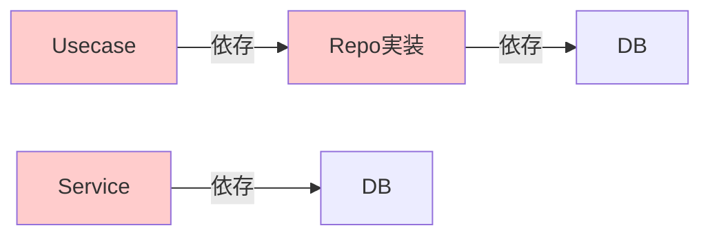
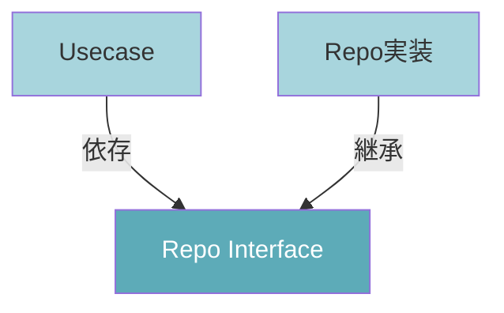

<style src="./style.css"></style>

## Onion Architectureについて

<div class="pt-12">
  <span class="text-sm opacity-75">千種直幹（バックエンドエンジニア）</span>
</div>

<div class="abs-br m-6 text-sm opacity-50">
  2025.12.3 LT会
</div>


---

## 今日のゴール

1. **「なぜ」** このアーキテクチャを採用するのかを理解する
2. **DDD（ドメイン駆動設計）** の基礎的な考え方を共有する
3. **オニオンアーキテクチャ** における各層の実装責任を把握する
4. 各層に **「何を書くべきか」の判断基準** を持つ

---
transition: none
---
## まずはDDDについて

<div class="grid grid-cols-2 gap-8">

<div class='text-sm leading-tight' style="font-size: 0.85rem;">

<p style="margin: 0.3rem 0;">ビジネスの複雑さをコードで表現するための設計思想</p>

**例：ユーザー登録**

<div class="border border-gray-300 rounded bg-gray-50" style="padding: 0.4rem; margin-bottom: 0.4rem; font-size: 0.7rem; line-height: 1.3;">

<p style="margin: 0 0 0.2rem 0; font-weight: 600;">データ中心のアプローチ:</p>
<ul style="margin: 0; padding-left: 1.2rem; line-height: 1.3;">
<li style="margin: 0.1rem 0; font-size: 0.7rem;">ID, name, email, is_activeが入ったレコード</li>
</ul>

</div>

<div class="border border-blue-300 rounded bg-blue-50" style="padding: 0.4rem; margin-bottom: 0.4rem; font-size: 0.7rem; line-height: 1.3;">

<p style="margin: 0 0 0.2rem 0; font-weight: 600;">DDDのアプローチ:</p>
<ul style="margin: 0; padding-left: 1.2rem; line-height: 1.3;">
<li style="margin: 0.1rem 0; font-size: 0.7rem;">「不正なメールアドレスは登録できない」</li>
<li style="margin: 0.1rem 0; font-size: 0.7rem;">「名前が短すぎる場合は登録できない」</li>
</ul>

<p style="margin: 0.3rem 0 0 0; font-size: 0.7rem;">→ データではなく<strong>ビジネスルール（振る舞い）</strong> をコードで表現</p>

</div>

<div class="border border-green-300 rounded bg-green-50" style="padding: 0.4rem; font-size: 0.7rem; line-height: 1.3;">

<p style="margin: 0 0 0.2rem 0; font-weight: 600;">Value Object（値オブジェクト）:</p>
<ul style="margin: 0; padding-left: 1.2rem; line-height: 1.3;">
<li style="margin: 0.1rem 0; font-size: 0.7rem;">バリデーションロジックが各所に散らばらない</li>
<li style="margin: 0.1rem 0; font-size: 0.7rem;">「型」自体にルールを持たせる</li>
</ul>

</div>

</div>

<div class="space-y-2" style="margin-top: -1.5rem;">
````md magic-move
```python
# Value Object の例
class Email(BaseModel):
    value: str

    @field_validator('value')
    def validate(cls, v):
        if "@" not in v:
            raise ValueError("Invalid Email")
        return v
```
```python {1-6|1,8-14|1,16-18}
# Entity の例：ルールがオブジェクトに凝集
class User(BaseModel):
    id: int
    name: str
    email: Email
    is_active: bool

    @classmethod
    def create(cls, name: str, email: str) -> User:
        if len(name) < 3:
            raise ValueError("名前が短すぎます")
        return cls(
            id=0, name=name,
            email=Email(value=email), is_active=True
        )

    def deactivate(self) -> None:
        self.is_active = False
```
````
</div>

</div>
---

## 理想の開発フロー

1. **要件定義**: 「何を実現したいか」を明確にする

2. **ドメイン分け（モデリング）**: ビジネスの境界線を定義（User, Product, Order...）

3. **設計・実装**:
   - ドメインモデルを中心に据える
   - DB設計やAPI定義は、ドメインモデルを実現するための手段として定義する

💡 **DBファーストではなく、ドメインファースト**で考える
   → ビジネスロジックの変更に強いシステムになる

---

## よくある「辛い」バックエンド

<div class="grid grid-cols-2 gap-1">

<div>

`FastAPI` のチュートリアル通りに作るとこうなりがち...

**問題点:**
- **責務過多**: 1つの関数が全てを知りすぎている
- **影響範囲不明**: 1行変えたらどこが壊れるか分からない
- **コード重複**: 似たようなロジックがコピペ増殖
- **テスト困難**: DBや外部APIがないとテストできない

→ 改修コストが高い密結合な状態へ

</div>

<div>

````md magic-move
```python
# app.py (全部入り)
@app.post("/users")
def create_user(name: str, email: str, age: int, db: Session = Depends(get_db)):
    # 1. バリデーション
    if not name or len(name) < 3:
        raise HTTPException(400, "名前が短すぎます")
    if not email or "@" not in email:
        raise HTTPException(400, "メールアドレスが不正です")
    if age < 18 or age > 120:
        raise HTTPException(400, "年齢が不正です")
    existing = db.query(User).filter(User.email == email).first()
    if existing:
        raise HTTPException(400, "既に登録済みです")
    # 2. ビジネスロジック
    # 3. DB操作(ORM)
    # 4. 外部APIコール
    # 5. レスポンス整形
```

```python
# app.py (全部入り)
@app.post("/users")
def create_user(name: str, email: str, age: int, db: Session = Depends(get_db)):
    # 1. バリデーション
    # 2. ビジネスロジック
    is_active = True
    is_premium = age >= 20  # 20歳以上はプレミアム
    points = 100 if is_premium else 50  # 初回ポイント付与
    created_at = datetime.now()
    # 招待コードがあればボーナスポイント
    if invite_code := request.headers.get("X-Invite-Code"):
        points += 500
    # 3. DB操作(ORM)
    # 4. 外部APIコール
    # 5. レスポンス整形
```

```python
# app.py (全部入り)
@app.post("/users")
def create_user(name: str, email: str, age: int, db: Session = Depends(get_db)):
    # 1. バリデーション
    # 2. ビジネスロジック
    # 3. DB操作(ORM)
    user = User(
            name=name,
            email=email, 
            age=age, 
            is_active=True)
    db.add(user)
    db.flush()  # IDを取得
    profile = UserProfile(user_id=user.id, points=points)
    db.add(profile)
    log = ActivityLog(user_id=user.id, action="registered")
    db.add(log)
    db.commit()
    # 4. 外部APIコール
    # 5. レスポンス整形
```

```python
# app.py (全部入り)
@app.post("/users")
def create_user(name: str, email: str, age: int, db: Session = Depends(get_db)):
    # 1. バリデーション
    # 2. ビジネスロジック
    # 3. DB操作(ORM)
    # 4. 外部APIコール
    try:
        send_welcome_email(email, name)  # メール送信
        slack_notify(f"新規登録: {name}")  # Slack通知
    except Exception as e:
        print(f"通知失敗: {e}")  # エラーは無視
    # 5. レスポンス整形
```

```python
# app.py (全部入り)
@app.post("/users")
def create_user(name: str, email: str, age: int, db: Session = Depends(get_db)):
    # 1. バリデーション
    # 2. ビジネスロジック
    # 3. DB操作(ORM)
    # 4. 外部APIコール
    # 5. レスポンス整形
    return {
        "id": user.id, 
        "name": user.name, "email": user.email,
        "is_premium": is_premium, "points": points,
        "registered_at": created_at.isoformat(),
        "status": "success", 
        "message": "登録完了しました"
    }
```
````

</div>

</div>

---
layout: center
class: text-center
---

## 解決策：オニオンアーキテクチャ

関心事の分離と依存方向の制御

---

## オニオンアーキテクチャの全体像

<div class="grid grid-cols-2 gap-8">

<div>

### 4つの層

- **Presentation**: API, I/F
- **Infrastructure**: DB, 外部SaaS
- **Application**: ユースケース
- **Domain**: ビジネスルール (中心)

### 絶対的なルール：

依存は必ず **外側から内側** へのみ。

内側は外側のことを知ってはならない。

</div>

<div class="flex items-center justify-center">


</div>

</div>

---

## Domain層

<div class="grid grid-cols-2 gap-8">

<div>

`backend/app/domain/`

ビジネスロジックの中核。フレームワークやDBの都合を持ち込まない。

**Entity (`entities/`)**

ビジネスロジックを持ったデータ構造。`Pydantic`を使用するが、DBモデルとは別物。

<div class="mt-8"></div>

**Repository Interface (`repositories/`)**

「データの保存・取得」という振る舞いの抽象定義のみ。**実装は書かない。**

</div>

<div class="space-y-4">

```python
class User(BaseModel):
    id: int
    name: str

    # ビジネスルールをここに書く
    def change_name(self, new_name: str):
        if len(new_name) < 3:
            raise ValueError("名前が短すぎます")
        self.name = new_name
```

```python
class UserRepository(ABC):
    @abstractmethod
    def save(self, user: User) -> User:
        pass
```

</div>

</div>

---

## Application層 - DTO (Schema)

<div class="grid grid-cols-2 gap-8">

<div>

`backend/app/application/schemas/`

**DTO (Data Transfer Object)**

データ転送用のオブジェクト。Entityとは別物。

- **Entity**: ビジネスルール用（Domain層）
- **DTO**: データ転送用（Application層）

Application層とPresentation層の間でデータをやり取りする際に使用。

</div>

<div>

```python
# schemas/user_schemas.py
from pydantic import BaseModel
from app.domain.entities.user import User

class UserDTO(BaseModel):
    id: int
    name: str

    @classmethod
    def from_entity(cls, entity: User) -> "UserDTO":
        """EntityからDTOに変換"""
        return cls(id=entity.id, name=entity.name)
```

</div>

</div>

---

## Application層 - Usecase

<div class="grid grid-cols-2 gap-8">

<div>

`backend/app/application/use_cases/`

**Usecase（ユースケース）**

ドメインオブジェクトを使って、やりたいことを達成する進行役。「何をするか」を記述し、「どうするか」の詳細はDomainやInfraに任せる。

**ルール:**
- Import可能: `Domain`
- Import不可: `Infrastructure`, `Presentation`

**トランザクション管理:**
- DBへのコミットは、Usecase呼び出しの外側で制御
- Presentation層には書かせない

</div>

<div>

```python
# use_cases/user_usecase.py
from app.domain.entities.user import User
from app.domain.repositories.user_repository import UserRepository
from app.application.schemas.user_schemas import UserDTO

class UserUsecase:
    def __init__(self, repo: UserRepository):
        self.repo = repo

    def register_user(self, name: str) -> UserDTO:
        # 1. Domain Entityの生成
        user = User.create(name=name)
        # 2. Repository（Interface）を使用して永続化
        saved_user = self.repo.save(user)
        # 3. DTOに変換して返す
        return UserDTO.from_entity(saved_user)
```

</div>

</div>

---

## Infrastructure層 - DB Model

<div class="grid grid-cols-2 gap-8">

<div>

`backend/app/infrastructure/db/models/`

**DB Model（データベースモデル）**

SQLAlchemy等のORM定義。Entityとは別に定義する。

**重要な制約:**
- CASCADEは非推奨
- 論理削除または手動削除ロジックを推奨

</div>

<div>

```python
# db/models/user_model.py
from sqlalchemy import Column, Integer, String, Boolean
from app.infrastructure.db.base import Base

class UserModel(Base):
    """ユーザーテーブル"""
    __tablename__ = "users"

    id = Column(Integer, primary_key=True, index=True)
    name = Column(String(100), nullable=False)
    is_deleted = Column(Boolean, default=False)
    # 論理削除フラグ
```

</div>

</div>

---

## Infrastructure層 - Repository実装

<div class="grid grid-cols-2 gap-8">

<div>

`backend/app/infrastructure/db/repositories/`

**Repository Implementation**

Domain層で定義したInterfaceを実装する。

DB ModelとEntityの相互変換を行う。

</div>

<div>

```python
# db/repositories/user_repository_impl.py
from sqlalchemy.orm import Session
from app.domain.entities.user import User
from app.domain.repositories import UserRepository
from app.infrastructure.db.models import UserModel

class UserRepositoryImpl(UserRepository):
    def __init__(self, db: Session):
        self.db = db

    def save(self, user: User) -> User:
        # Entity -> DB Model 変換
        user_dict = user.model_dump()
        if user.id == 0:  # 新規作成時はIDを除外
            del user_dict['id']

        db_model = UserModel(**user_dict)
        self.db.add(db_model)
        self.db.flush()  # ID確定

        # DBモデルをPythonオブジェクト（Entity）に変換して返す
        return User.model_validate(db_model)
```

</div>

</div>

---

## Presentation層

<div class="grid grid-cols-2 gap-8">

<div>

`backend/app/presentation/`

APIエンドポイントの定義。リクエストを受け取り、Application層に渡す。

**ポイント:**
- ロジックを書かない
- Usecaseを呼ぶだけ

</div>

<div>

```python
# api/user_api.py
@router.post("/users")
def create_user(
    schema: CreateUserSchema,
    usecase: UserUsecase = Depends(get_user_usecase)
):
    try:
        # ロジックは全てUsecaseに委譲する
        return usecase.register_user(schema.name)
    except ValueError as e:
        raise HTTPException(
                status_code=400, 
                detail=str(e)
                )
```

</div>

</div>

---

## 依存性逆転の原則 (DIP)

**なぜInterfaceを挟むのか？**

ApplicationがInfrastructureの実装詳細に依存すると、DB変更時にビジネスロジックも修正が必要になる。
Interfaceを介することで、実装の差し替えが容易になり、テストも簡単に。

**メリット:**
- **DBがなくてもテストができる**
- **外部APIがダウンしていても開発・テストが進められる**
- **実装の差し替えが容易**（PostgreSQL → MySQL など）

---

## 依存性逆転の原則 (DIP) - 図解

<div class="grid grid-cols-2 gap-8">

<div>

**通常（密結合）**

UsecaseがRepository実装に直接依存。
DB変更でUsecaseも修正が必要。



</div>

<div>

**DIP（依存性逆転）**

双方がInterface（抽象）に依存。
実装の差し替えが容易になる。



</div>

</div>

---

## DI層 - 依存性注入 (`backend/app/di/`)

**役割**: すべての層を繋ぎ、実際の依存関係を解決する唯一の場所

この層だけは、Application層の抽象とInfrastructure層の実装の両方を知ることが許される。

```python
# backend/app/di/user_di.py
from fastapi import Depends
from sqlalchemy.orm import Session

from app.application.use_cases import UserUsecase
from app.infrastructure.db.repositories import UserRepositoryImpl
from app.infrastructure.db.database import get_db

def get_user_usecase(db: Session = Depends(get_db)) -> UserUsecase:
    # 1. Infrastructure層の実装を生成
    repo = UserRepositoryImpl(db)

    # 2. Application層のUsecaseに注入して返す
    return UserUsecase(repo)
```

**使い方**: Presentation層のAPIエンドポイントで`Depends(get_user_usecase)`を使用

---

## アーキテクチャの恩恵：テスト

<div class="grid grid-cols-2 gap-8">

<div>

**DBなしでビジネスロジックをテストする**

Repositoryをモック化することで、DB接続なしでUsecase単体のテストが可能になります。

**メリット:**
- テストが高速（DBセットアップ不要）
- CIでも軽快に動作
- ビジネスロジックに集中できる

→ これが「インターフェースを切る意味」

</div>

<div>

```python
# test_user_usecase.py

# 1. テスト用のモックリポジトリ（メモリに保存するだけ）
class MockUserRepository(UserRepository):
    def save(self, user: User) -> User:
        return user  # DBには繋がない

# 2. 本物のUsecaseに、偽物のリポジトリを渡す
def test_register_user():
    usecase = UserUsecase(repo=MockUserRepository())

    # 3. 高速にビジネステストが実行可能
    result = usecase.register_user("Tom")
    assert result.name == "Tom"
    # DB接続なしでロジックを検証することができる
```

</div>

</div>

---

## まとめ：開発の進め方

1. **Domain層**: EntityとRepository Interfaceを作る
   - ここでビジネスルールを固める

2. **Infrastructure層**: Repositoryの実装を書く
   - SQLや外部連携の詳細を書く

3. **Application層**: Usecaseを書く
   - DomainとRepo IFを使って処理の流れを作る

4. **Presentation層**: API定義を書く
   - 入力を受け取り、Usecaseに流す

5. **DI層**: 全体を繋ぎ込む

面倒に見えますが、責務が明確になり、
長期的な保守性と変更に強いシステムになります。

---
layout: center
class: text-center
---

## DDDを学ぶおすすめの書籍

<div class="flex flex-col items-center justify-center h-full gap-4">
  
  <a href="https://www.amazon.co.jp/dp/B082WXZVPC" target="_blank" class="text-blue-600 hover:underline">
    Amazonで見る
  </a>
</div>

---
layout: center
class: text-center
---

# おしまい

